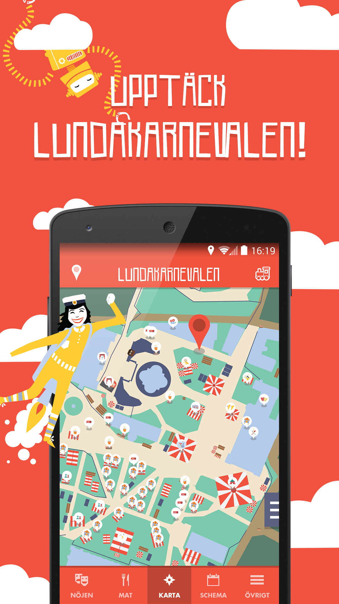

Lundakarnevalen 2014 - Android
======================

The external Android application for Lundakarnevalen 2014!

## Google Play listing
The application was published on [Google Play Store](https://play.google.com/store/apps/details?id=se.lundakarnevalen.extern.android)

## Screenshots
Screenshots from Google Play

| |
 |

## Contibutions
The application was written during 3-4 weeks during Q2 2014. 

### Main contributors
 * Markus Larsson - [@karlmarkuslarsson](https://github.com/karlmarkuslarsson)
 * Filip Lindqvist - [@tkhduracell](https://github.com/tkhduracell)
 * Fredrik Lindman - [@fredrikpersson](https://github.com/fredrikpersson)

### Upstream
The upstream repository is now public at 
https://github.com/Lundakarnevalen/futural-extern-android
 
## Design documents
[See more](DESIGN.md)
